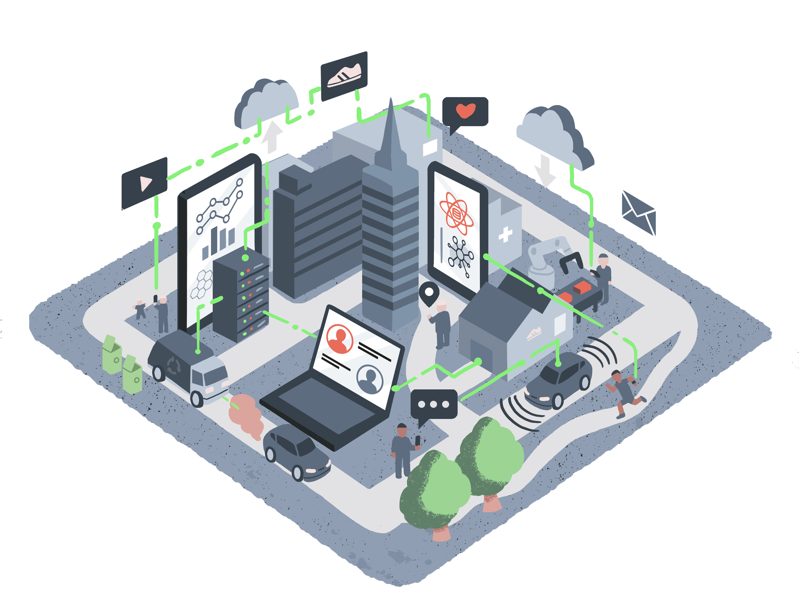

# About

## Summary

Responsible research and innovation (RRI) plays a significant and often central role within academic, public, private, and third-sector organisations.
For example, the UKRI’s Engineering and Physical Sciences Research Council (EPSRC) is increasingly making a commitment to RRI necessary for research funding, and also embedding RRI training into its Centres for Doctoral Training. 
Furthermore, the UK Government has highlighted the importance of RRI in both of its national data and national AI strategies.

Building on these commitments, this course will explore what it means to take (individual and collective) responsibility for (and over) the processes and outcomes of research and innovation in data science and AI.

The notion of ‘responsibility’ employed throughout this course will be grounded in an understanding of the moral relationship between science, technology, and society, exploring both historical and contemporary examples of RRI practices.
As well as looking at the theoretical basis of RRI this course will also take a hands-on approach by exploring a variety of tools and procedures that can help operationalise and implement a robust notion of responsibility within research and innovation practices.

## Who is this Guidebook For?

Primarily, this guidebook is for researchers with an active interest in RRI.
This doesn't mean you have to be a data scientist, or a researcher using R or Python to analyse data.
You could be an ethicist, sociologist, or someone with an interest in law and policy.
However, the guide is oriented towards research issues and related topics.

In addition, while this course has practical, and sometimes hands-on activities, these activities are geared towards ethical reflection and deliberation.
If you want to dive deeper into the specific day-to-day requirements of RRI for data science, we recommend heading on over to [The Turing Way](https://the-turing-way.netlify.app/welcome) community, organised by our fantastic colleagues.

## Learning Objectives

This guidebook has the following learning objectives:

- Understand what is meant by the term ‘responsible research and innovation’, including the motivation and historical context for its increasing relevance.
- Identify and evaluate the ethical issues associated with the key stages of a typical data science or AI project lifecycle: (project) design, (model) development, (system) deployment.
- Explore practical tools and mechanisms for operationalising the concept of ‘responsibility’ within the context of data science and AI research and innovation.
- Gain an appreciation of shared goals and values across scientific disciplines and research domains through dialogue with other participants.

## Table of Contents

1. [Introduction](intro/index.md)
2. [What is Responsible Research and Innovation?](chapter2/index.md)
3. [Responsible Data Science and AI](chapter3/index.md)
4. [The Project Lifecycle](chapter4/index.md)
5. [Responsible Communication](chapter5/index.md)
6. [Conclusion](conclusion/index.md)
7. [Further Resources](further_resources/index.md)
8. [Bibliography](../bibliography.md)

### List of Activities

1. [Exploring Historical Case Studies](chapter2/activity2-1.md)
2. [Ethical Reflection and Deliberation](chapter2/activity2-2.md)
3. [Specifying Principles](chapter3/activity3-1.md)
4. [Contributing to Collaborative Projects](chapter3/activity3-2.md)
5. [Bias Cards](chapter3/activity3-3.md)
6. [Privilege Walk](chapter4/project_design/activity4-1.md)
7. [Developing Case Studies](chapter4/project_design/activity4-2.md)
8. [Identifying Missing Data](chapter4/project_design/activity4-3.md)
9. [Designing Model Reports](chapter4/model_development/activity4-4.md)
10. [Building an Assurance Case](chapter5/activity5-1.md)